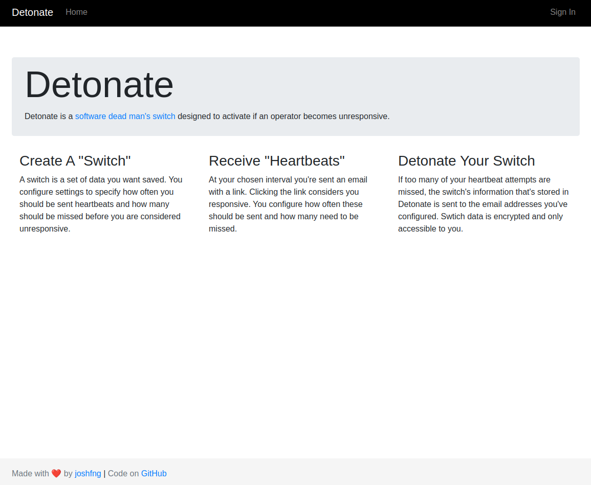

# Detonate

> A dead man's switch is a switch that is designed to be activated or deactivated if the human operator becomes incapacitated, such as through death, loss of consciousness, or being bodily removed from control[^1]

Detonate is a software dead man's switch[^2] designed to activate if an operator becomes unresponsive

Detonate encrypts and stores valuable information and checks in at a configurable interval. If the operator fails to check in with a heartbeat a configurable number of times, the valuable information is released to a configured list of recipients.

## TODO

- Improve README/better documentation/getting started
- More ways to send and acknowledge heartbeats (incoming webhooks, sms, chat apps)
- More than text based info storage (encrypted file storage, videos, audio)
- More ways to expose the information when detonating besides just emailing it out (publish to external platforms/blogs/social media, sms, chat apps, rss, even physical mailings)

[^1]: [https://en.wikipedia.org/wiki/Dead_man%27s_switch](https://en.wikipedia.org/wiki/Dead_man%27s_switch)
[^2]: [https://en.wikipedia.org/wiki/Dead_man%27s_switch#Software](https://en.wikipedia.org/wiki/Dead_man%27s_switch#Software)

